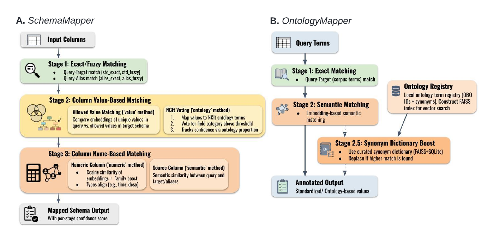

# MetaHarmonizer: a robust, fully local biomedical metadata harmonization system

The pre-print is now available: [MetaHarmonizer: robust biomedical
metadata harmonization and a contamination control for inflated LLM
performance on public
benchmarks](https://www.biorxiv.org/content/10.64898/2026.06.13.732088v1)

MetaHarmonizer currently provides two key modules:

| Module | Engine | Purpose |
|-----------------------|-----------------------|--------------------------|
| SchemaMapper (SM) | `SchemaMapEngine` | Map clinical-data columns to standardized field names (dict → fuzzy → value → name). |
| OntologyMapper (OM) | `OntoMapEngine` | Map free-text values to ontology terms (exact → semantic → synonym). |



## Table of contents

1.  [Installation](#1-installation)
2.  [Environment variables](#2-environment-variables)
3.  [Quickstart](#3-quickstart)
4.  [Datasets](#4-datasets)
5.  [Ontology mapping reference](#5-ontology-mapping-reference)
6.  [Schema mapping reference](#6-schema-mapping-reference)
7.  [Example notebooks](#7-example-notebooks)

## 1. Installation

``` bash
# Clone
git clone https://github.com/shbrief/MetaHarmonizer
cd MetaHarmonizer

# Create a Python 3.10 environment
conda create -n mh python=3.10 -y
conda activate mh
pip install --upgrade pip

# Install the package. Pick one of:
pip install -e .                       # core only (no LLM backends)
pip install -e ".[llm-gemini]"         # + Gemini (Stage-4 LLM, OntoMapLLM, etc.)
pip install -e ".[llm-openai]"         # + OpenAI (FieldSuggester semantic clustering)
pip install -e ".[llm-anthropic]"      # + Anthropic (Claude LLM backend)
pip install -e ".[notebook]"           # + nest-asyncio for Jupyter workflows
pip install -e ".[dev]"                # + pytest & coverage
pip install -e ".[eval]"               # + scipy for evaluation scripts
pip install -e ".[all]"                # notebook + eval + all three LLM backends

# Set up environment variables (see the table below)
cp .env.example .env
```

Install directly from GitHub (non-editable):

``` bash
pip install "git+https://github.com/shbrief/MetaHarmonizer#egg=metaharmonizer[llm-gemini]"
```

> The full ontology corpus is **not bundled** in the wheel. Set
> `METAHARMONIZER_DATA_DIR` (see [Environment
> variables](#2-environment-variables)) to point at a local copy, or let
> the engine fetch/build it on first run (set `UMLS_API_KEY` and/or pass
> `corpus_df=`). A small reference dataset (`schema/curated_fields.csv`,
> `corpus/oncotree_code_to_name.csv`, etc.) ships inside the wheel for
> `SchemaMapEngine` and OncoTree lookups. Small, runnable sample inputs
> for the demo notebooks live under [`examples/data/`](examples/data/).

## 2. Environment variables

Configuration is resolved through a single precedence chain (highest wins):

```
engine/CLI argument  >  environment variable  >  project config file  >  built-in default
```

- **Arguments** — what changes per run, passed to `OntoMapEngine` /
  `SchemaMapEngine` (e.g. `s2_method`, `top_k`, `curated_dict_path`,
  `value_dict_path`, `alias_dict_path`, `corpus_hash`).
- **Environment variables** — secrets and deployment/ops (table below).
- **Project config file** — project-level defaults; see
  [Project config file](#project-config-file).
- **Built-in defaults** — ship with the package; everything works unset.

Copy `.env.example` → `.env` (or export in your shell) before running
the mappers. `python-dotenv` auto-loads `.env` on import. `UMLS_API_KEY`
and `GEMINI_API_KEY` are **secrets** — env-only, never put them in a
config file.

| Variable | Required for | Default | Notes |
|------------------|-------------------------|------------------|------------------|
| `UMLS_API_KEY` | [OM Stage 2.5] NCI Thesaurus lookups, concept-table builder, `update_term_via_code` | — | Required for `ontology_source="ncit"` pipeline stages that hit the live API. |
| `METAHARMONIZER_DATA_DIR` | Locating corpus + schema reference files (`oncotree_code_to_name.csv`, `curated_fields.csv`, etc.) | `~/.metaharmonizer/data` | Small reference files ship inside the wheel as a fallback when this dir is empty; set this to a local corpus copy to override. |
| `SM_OUTPUT_DIR` | `SM` output path | `$METAHARMONIZER_DATA_DIR/schema_mapping_eval` | Overrides where CSV results are written. |
| `FIELD_VALUE_JSON` | SM value dictionary | `$METAHARMONIZER_DATA_DIR/schema/field_value_dict.json` | Point at an alternative value dict. |
| `VECTOR_DB_PATH` | OM Knowledge-DB SQLite file | `$KNOWLEDGE_DB_DIR/vector_db.sqlite` | — |
| `FAISS_INDEX_DIR` | OM STage 2/3 FAISS index cache | `$KNOWLEDGE_DB_DIR/faiss_indexes` | — |
| `KNOWLEDGE_DB_DIR` | Root dir for KnowledgeDb assets | `~/.metaharmonizer/KnowledgeDb` | — |
| `METHOD_MODEL_YAML` | Method→model registry | bundled `src/metaharmonizer/models/method_model.yaml` | — |
| `MODEL_CACHE_ROOT` / `MODEL_CACHE_DIR` | Hugging Face model cache | `~/.metaharmonizer/model_cache` | `MODEL_CACHE_ROOT` takes precedence; `MODEL_CACHE_DIR` is a fallback. |
| `FIELD_MODEL` | SM embedding stages encoder | `all-MiniLM-L6-v2` | — |
| `NCIT_POOL_SIZE` | NCI async client connection pool | `8` | Raise for bulk corpus builds. |
| `LOG_FILE` / `LOG_ENV` | Logger config | `out.log` / `development` | — |

### Project config file

Project-level defaults (thresholds, model keys, the noise-value set) can be
set without code changes in `metaharmonizer.toml` (the whole file) or a
`[tool.metaharmonizer]` table in `pyproject.toml`, discovered from the current
working directory. These sit *below* environment variables and arguments in
the precedence chain, so a per-run argument always wins.

```toml
# metaharmonizer.toml  (or [tool.metaharmonizer] in pyproject.toml)
field_model = "minilm-l6"      # method key from method_model.yaml
llm_model   = "gemma-27b"
topk        = 5

# schema-mapper thresholds
fuzzy_thresh            = 92
numeric_thresh          = 0.6
field_alias_thresh      = 0.5
value_dict_thresh       = 0.85
value_unique_cap        = 50
value_percentage_thresh = 0.2
llm_threshold           = 0.5

# replaces the built-in noise-value set when present
noise_values = ["yes", "no", "unknown", "not reported", "n/a"]
```

> Parsing uses the stdlib `tomllib` (Python ≥ 3.11) or the optional `tomli`
> backport on 3.10. If neither is available the file layer is silently
> skipped and built-in defaults apply.

## 3. Quickstart

The snippets below read the small sample inputs under
[`examples/data/`](examples/data/) (run them from the repo root, or
adjust the paths to your own files). Pass `corpus_df=` to
`OntoMapEngine` or set `UMLS_API_KEY` so the engine can fetch the
ontology corpus on first use.

> The initial `OntoMapEngine` run takes \~4 min while it builds the
> FAISS index; subsequent runs reuse the cache and take \~7 sec.

### Ontology mapping

``` python
import pandas as pd
from metaharmonizer import OntoMapEngine

df = pd.read_csv("examples/data/disease_query_updated.csv")
engine = OntoMapEngine(
    category="disease",
    query=df["original_value"].tolist(),
    cura_map=dict(zip(df["original_value"], df["curated_ontology"])),
    s2_method="sap-bert",
    s2_strategy="st",
    test_or_prod="test",
    output_dir="examples/data/outputs",
)
results = engine.run()
print(results.head())
```

### Schema mapping

``` python
from metaharmonizer import SchemaMapEngine

engine = SchemaMapEngine(
    clinical_data_path="examples/data/sm_test.tsv",
    mode="manual",   # "auto" or "manual"
    top_k=5,
)
results = engine.run_schema_mapping()
print(results.head())
```

Richer examples (custom corpus, MONDO/UBERON sources, Stage-4 LLM
review) are in the reference sections below and the notebooks under
[`examples/`](examples/).

## 4. Datasets

-   For **ontology mapping**, you must provide:
    -   A list of query terms via the `query` parameter (or a
        `query_df` + `query_col` pair).
    -   A `corpus` list and/or `corpus_df` are **optional** — the engine
        auto-resolves them from cached CSV or the API when not provided.
-   For **schema mapping**, provide a clinical metadata file. The
    schema-mapping reference dictionary ships bundled inside the wheel
    (`src/metaharmonizer/_bundled_data/schema/`).
-   Small, runnable sample inputs for the demo notebooks live under
    [`examples/data/`](examples/data/); they are illustrative, not the
    full research corpora.

## 5. Ontology mapping reference

**Using a non-NCIt ontology (e.g. MONDO):**

``` python
from metaharmonizer import OntoMapEngine

engine = OntoMapEngine(
    category="disease",
    query=query_list,
    cura_map=cura_map,
    s2_method="sap-bert",
    s2_strategy="st",
    s3_strategy="rag",
    test_or_prod="test",
    ontology_source="mondo",  # uses EBI OLS4 API
)
results = engine.run()
```

**Custom corpus (advanced):**

``` python
import pandas as pd
from metaharmonizer import OntoMapEngine

# Provide your own corpus_df — ontology_source is inferred from code prefixes.
# A content hash isolates user tables from the official ones, so different
# corpora never cross-contaminate each other or the built-in tables.
my_corpus = pd.read_csv("my_custom_corpus.csv")  # must have 'label' and 'obo_id' columns
engine = OntoMapEngine(
    category="disease",
    query=query_list,
    cura_map=cura_map,
    s2_strategy="lm",
    test_or_prod="test",
    corpus_df=my_corpus,
    output_dir="data/outputs/my_run",  # optional: auto-save results here
)
results = engine.run()
```

**Parameters:** - **category** (str): Ontology category — `disease`,
`bodysite`, or `treatment`. - **query** (list): List of query terms to
map. - **query_df** (DataFrame, optional): DataFrame query mode
(alternative to `query`); requires `query_col`. - **query_col** (str,
optional): Column in `query_df` holding the query terms. - **cura_map**
(dict): Mapping of query terms to curated ontology values (for
evaluation in `test` mode). - **corpus** (list, optional): Explicit list
of corpus terms for **Stage 2 matching only** (Stage 3 always uses
`corpus_df`). Auto-derived from `corpus_df` when omitted. -
**corpus_df** (DataFrame, optional): DataFrame with `label` and `obo_id`
columns. Auto-loaded from cached CSV or built from API when omitted. -
**ontology_source** (str, default `"ncit"`): Ontology backend.
Supported: `ncit` (NCI Thesaurus via EVSREST), `mondo`, `uberon` (via
EBI OLS4 API). When `corpus_df` is provided, this is inferred from code
prefixes. - **s2_strategy** (str): Stage 2 strategy — `lm` (CLS-token
pooling) or `st` (SentenceTransformer mean pooling). - **s2_method**
(str): Transformer model key from `method_model.yaml` (e.g. `sap-bert`,
`pubmed-bert`). - **s3_strategy** (str, optional): Stage 3 strategy —
`rag`, `rag_bie`, or `None` to disable. - **topk** (int, default 5):
Number of top matches per query. - **test_or_prod** (str): `test`
includes curated_ontology in output for evaluation; `prod` omits it. -
**output_dir** (str, optional): Directory to auto-save result CSV.
Filename pattern:
`om_{ontology_source}_{category}_s2_{strategy}_{method}_{timestamp}.csv`. -
**persist_corpus** (bool, default `False`): When `True` and `corpus_df`
is caller-provided, persist it to the cache CSV.

**Pipeline stages:** - **Stage 1:** Exact matching against corpus. -
**Stage 2:** Embedding-based similarity (LM or ST strategy). - **Stage
2.5:** Synonym verification — boosts low-confidence Stage 2 matches
using synonym data from concept tables. - **Stage 3** (optional):
RAG-based re-matching with retrieved context from the knowledge
database.

**Output:** DataFrame with top-k matches, scores, and match levels for
each query term.

## 6. Schema mapping reference

``` python
from metaharmonizer import SchemaMapEngine

engine = SchemaMapEngine(
    clinical_data_path=YOUR_QUERY_FILE,
    mode="manual",   # "auto" or "manual"
    top_k=5,
)

# Run Stage 1, 2 & 3 (and 4 if mode="auto")
engine.run_schema_mapping()

# (Optional) Run Stage 4 after manual review
engine.run_llm_on_file(
    input_csv="path_to_stage3_results.csv",
    output_csv="path_to_stage3_results_with_stage4.csv",
    stage_filter=["stage3"],
    merge_results=True,
)
```

**Parameters:** - **clinical_data_path** (str): Path to clinical dataset
(TSV or CSV). - **mode** (str): - `"auto"` → automatically proceed to
Stage 4 if Stage 3 confidence is low. - `"manual"` → output Stage 3
results for review; Stage 4 must be triggered manually. - **top_k**
(int): Number of top matches returned for each column.

**Output:** - CSV file saved to `SM_OUTPUT_DIR` (see [Environment
variables](#2-environment-variables)). Filename patterns: -
`<input_root>_s3_<field_model_short>_<mode>_<YYYYMMDD_HHMMSS>.csv`
(manual mode) -
`<input_root>_s3_<field_model_short>_s4_<llm_model_short>_<mode>_<YYYYMMDD_HHMMSS>.csv`
(auto mode) - When Stage 4 is run manually via `run_llm_on_file(...)`,
`output_csv` controls the filename and location. - Columns: `query`,
`stage` (stage1/stage2/stage3), `method` (dict, fuzzy, numeric, alias,
bert, freq), and `match{i}`, `match{i}_score`, `match{i}_source` for the
top-k matches.

## 7. Example notebooks

Demonstration notebooks for the ontology and schema mappers live under
[`examples/`](examples/). See [examples/README.md](examples/README.md)
for an overview of each notebook and its required inputs.
